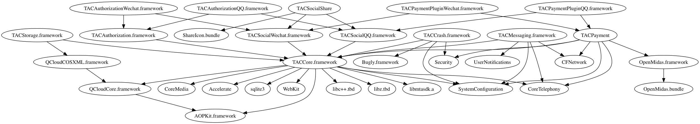

# Demo 使用指南

请点击 [这里](https://ios-release-1253960454.cos.ap-shanghai.myqcloud.com/tac.zip) 下载 Demo

# 通过 Cocoapods 集成：

在 Demo 工程目录下运行
~~~
pod install
~~~
即可。


# 通过手动集成

选择您需要的模块，并根据下属依赖关系引入响应的模块。

> 图片解释：    
1. 所有以 .framework 结尾的，都是我们提供的框架，需要手动拖入项目工程中去安装。
2. 所有以.tbd结尾，以及没有后缀名称的，都是系统的框架，需要在 XCode 中，项目的 Build Phases - Link Binary with Libraries 里，点击加号按名称搜索并添加。
3. 图中标示了完整的依赖关系，箭头指向的是依赖的模块，如果该模块有箭头指向别的地方，说明它需要依赖别模块。如果需要引入某个模块，则需要引入整个依赖关系链上的**所有**模块。

整个集成过程可以分为两步，先集成 TACCore 模块，再集成你所需要的模块即可。此外我们也提供了手动集成的Demo，可以先试着运行 Demo 看看效果，然后按照下面的步骤进行集成。

# TACCore 手动集成指南
TACCore是最基础的模块，只要使用到了TAC的服务，就需要引入TACCore模块，下面演示如何引入TACCore模块。    

引入 TACCore 模块分四步，先引入外部依赖库，再引入系统依赖库，修改编译参数，最后导入配置文件无须担心，每一步下面都有非常详细的说明和图解，引入 TACCore以外的其它模块也是重复前三步即可。
## 1.引入外部依赖库
    


依次将以下文件拖入到工程中，并且勾选 Copy items if needed
- TACCore.framework
- QCloudCore.framework
- AOPKit.framework
- libmtasdk.a    


## 2.引入系统依赖库
    

在项目的 Build Phases里（入口见图片）,依次搜索并添加以下依赖库：
- libz.tbd
- libsqlite3.tbd
- libstdc++.tbd
- CoreTelephony.framework
- SystemConfiguration.framework
- QCloudCore.framework
- TACCore.framework


## 3.修改编译参数 Other Linker Flags
    
按照图中所示步骤，在项目的 Build Phases里加入以下参数
```
-all_load
```    
> 因为SDK里面部分方法是放在 Category 里去实现的，如果不加入这个参数的话，对于外部的 framework，编译时默认是不加载 Category 的，会造成SDK内的许多方法在运行时不存在，并且报 Unrecognized selector 的错误。    

## 4.导入统一配置文件    


SDK 启动时会从配置文件中读取配置并初始化，这里将控制台下载的配置文件拖入工程中，并且勾选 Copy Items If Needed即可。

## 5.配置SDK需要的脚本
像我们使用到的一些如QQ, 微信登录模块需要注册相关的 URL Scheme，而 Crash 上报相关的SDK还需要在在 Info.plist文件里设置相关信息等。为了简化这些步骤，我们提供了配置脚本来完成上述工作。
> 事实上，XCode在编译一个项目时会有好几个阶段，我们可以在某些想要的阶段里添加自定义的动作，例如运行一段脚本等，只要在编译前通过脚本来修改文件，那么编译时取的就是我们修改后的文件去编译，这也是通过脚本来设置一些配置的原理。

配置脚本有两种：
- 在构建前运行的脚本，该类脚本主要是修改一些配置信息，如修改 Info.plist 文件等。
- 在构建之后运行的脚本，例如解析 Crash 用的符号表上报。


所以，我们可以在添加构建前和构建后两个 Build Phase，并在这两个阶段分别制定运行我们对应的脚本即可。

### 添加 Run Script Phases
   

按照图中所示的步骤，添加两个 Run Script Phases。需要留意的是，对于构建前运行的脚本，我们需要放在 Build Phases 里的第二个位置 （拖动可以更改位置），而对于构建后运行的脚本，我们需要放在 Build Phases 里的倒数第二个位置。

### 添加构建前运行脚本 Run Before Script

我们的配置运行脚本打包在了 TACCore.framework 中的 Scripts 目录里，所以这里我们的目标就是让这个脚本在构建前运行即可，也就是说，我们只需要将这个脚本的路径在构建前运行的 Run Script Phases 中正确设置即可。    

点击前面添加的构建前运行的 Run Script Phases, 如果是按照前文进行的方式集成的，那么粘贴下面代码进去即可 ( ${SRCROOT} 指项目所在的根目录，这个路径指的是项目根目录下的TACCore.framework/Scripts/tac.run.all.before.sh，如果对应的TACCore.framework放在了其它地方可对应修改)：
~~~
${SRCROOT}/TACCore.framework/Scripts/tac.run.all.before.sh
~~~    

如果上面的路径不对，或者不知道脚本实际路径该怎么拼，还可以找到TACCore.framework，将Scripts/tac.run.all.before.sh 拖入框中。这么做的缺点就是路径是针对你当前的计算机固定的，如果通过 Git 或者 SVN 托管代码后，其他开发者按这个路径是获取不到脚本的。


### 添加构建后运行脚本 Run After Script

添加构建后运行的脚本和前面添加构建前运行的脚本同理，只不过路径不一样，路径可以复制下面的路径：
~~~
${SRCROOT}/TACCore.framework/Scripts/tac.run.all.after.sh
~~~
如果采用拖入方式的话，也是和前面一样的步骤：

# TACPayment 手动集成指南
> 集成该模块之前，需要先集成 TACCore 模块，请参照前文。

引入外部依赖库和系统依赖库的方式可以参考 TACCore 中集成的步骤，这里不再赘述具体操作。
### 外部依赖库
- OpenMidas.framework
- OpenMidas.bundle
- TACPayment.framework
- TACPaymentPluginQQ.framework
- TACPaymentPluginWechat.framework
### 系统依赖库
- CFNetwork
- SystemConfiguration
- CoreTelephony
- Security
- libz.tbd
- libsqlite3.tbd
- libstdc++.tbd

# TACAuthorization 手动集成指南
> 集成该模块之前，需要先集成 TACCore 模块，请参照前文。

引入外部依赖库的方式可以参考 TACCore 中集成的步骤，这里不再赘述具体操作。

### 外部依赖库
- TACAuthorizationQQ.framework
- TACAuthorizationWechat.framework
- TACAuthorization.framework

# TACCrash 手动集成指南
> 集成该模块之前，需要先集成 TACCore 模块，请参照前文。

引入外部依赖库和系统依赖库的方式可以参考 TACCore 中集成的步骤，这里不再赘述具体操作。

### 外部依赖库
- TACCrash.framework
- Bugly.framework

### 系统依赖库
- Security

# TACStorage 手动集成指南
> 集成该模块之前，需要先集成 TACCore 模块，请参照前文。

引入外部依赖库的方式可以参考 TACCore 中集成的步骤，这里不再赘述具体操作。

### 外部依赖库
- QCloudCOSXML.framework
- QCloudCore.framework
- TACStorage.framework

# TACMessaging 手动集成指南
> 集成该模块之前，需要先集成 TACCore 模块，请参照前文。

引入外部依赖库和系统依赖库的方式可以参考 TACCore 中集成的步骤，这里不再赘述具体操作。

### 外部依赖库
- libXG-SDK.a
- TACMessaging.framework

### 系统依赖库
- UserNotificaitons

# TACSocialShare
> 集成该模块之前，需要先集成 TACSocialQQ, TACSocialWechat 模块，请参照前文。


## 外部依赖库
- ShareIcons.bundle

# 出错排查指南
>因为 SDK 依赖关系较为繁杂，需要修改的相对较多，中途容易忽略某些环节造成出错，这也是我们推荐使用 Cocoapods 集成的原因。但出错时也不必惊慌，按照以下指南一步步进行排查，即可解决大部分的错误。    

手动引入容易出现的错误主要分两大类：
-  集成以后，编译时候报错。
    - 编译器报错显示 "Undefined symbols xxxx for architecture x86_64"
      - 这是因为某个模块缺少了依赖库，请按照前面的依赖图来检查是否所有动态库.framework, 静态库.a, 以及依赖的系统库都完整的导入了。

    - 编译器报错显示 "Duplicate symbols  in xxx"
      - 如果没有重复引入某个库的话，这种情况多数是由于你所引入的某个第三方 SDK 将我们 SDK 里的某个库一起打包进去导致的，可以手动取出第三方库中重复的 Symbols

    - 编译器报错显示 "Shell Script Invocation Error"
      - 查看具体报错信息，如果显示的是 tac.run.all.after.sh 或者 tac.run.all.before.sh 为 No such file or directory, 则说明配置运行脚本时候路径出错，可寻找对应的具体脚本路径，然后重新设置或者拖入对应的 Build Phases里。

-  集成成功以后，编译通过，但运行时调用SDK里的方法出错了。

  - 运行时，SDK 内的方法调用出错，显示 "Unrecognized selector"
    - 集成时候漏了设置 Other Linker Flags参数导致。

  - 运行时出错，显示没有配置文件
    - 集成时候漏了配置文件导致的。
